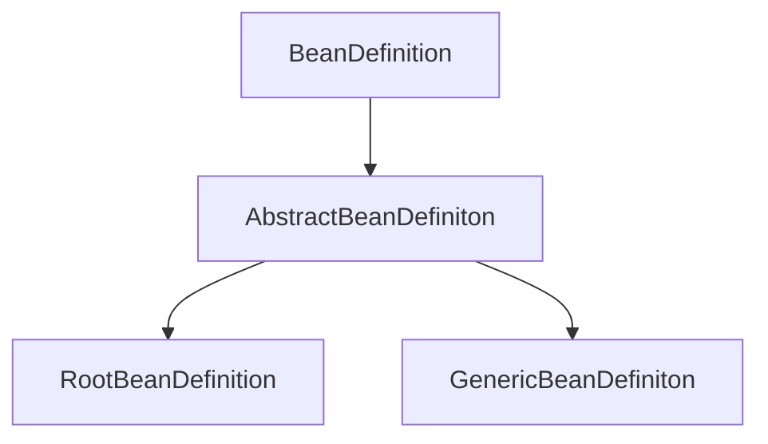

1. #### `Bean`的生命周期

------


##### 基于XML配置文件：

1.创建XML文件，定义`Bean`的信息

2.通过`ClassPathXMlApplicationContenxt`类的`ClassPathXMlApplicationContenxt("beans.xml")`,XML文件存于`AbstractRefreshableConfigApplicationContenxt`中的`ConfigLocations`内

```java
	/*
	* ClassPathXMlApplicationContenxt
	*/
	public ClassPathXmlApplicationContext(
			String[] configLocations, boolean refresh, @Nullable ApplicationContext parent)
			throws BeansException {

		super(parent);
		setConfigLocations(configLocations);
		if (refresh) {
			refresh();
		}
	}

	public void setConfigLocations(@Nullable String... locations) {
		if (locations != null) {
			Assert.noNullElements(locations, "Config locations must not be null");
			this.configLocations = new String[locations.length];
			for (int i = 0; i < locations.length; i++) {
				this.configLocations[i] = resolvePath(locations[i]).trim();
			}
		}
		else {
			this.configLocations = null;
		}
	}
```

3.执行`refresh`,`AbstractApplicationContenxt`是`ApplicationContenxt`的抽象实现类，该方法定义了容器在加载配置文件后的各种处理，这里会调用通用refresh处理类`AbsractRefreshApplicationContenxt`处理刷新容器的任务，在`AbsractRefreshApplicationContenxt`中的`refreshBeanFactory`方法中调用`loadBeandefinitions`方法通过`location`获取`Resources`对象，该对象是一个数组，然后让具体实现加载Bean定义的类通过该resource去加载bean的定义，也就是让`XmlBeandefinitionReader`去通过生成的Resources加载Beandefinition

```java
/*
* AbstractApplicationContenxt
*/
@Override
	public void refresh() throws BeansException, IllegalStateException {
    	...
			// Tell the subclass to refresh the internal bean factory.
			ConfigurableListableBeanFactory beanFactory = obtainFreshBeanFactory();
  		...
  }

	/**
	 * Tell the subclass to refresh the internal bean factory.
	 * @return the fresh BeanFactory instance
	 * @see #refreshBeanFactory()
	 * @see #getBeanFactory()
	 */
	protected ConfigurableListableBeanFactory obtainFreshBeanFactory() {
		refreshBeanFactory();//实现方法 - AbstractRefreshApplicationContext.refreshBeanFactory() \ GenericApplicationContext.refreshBeanFactory()
		return getBeanFactory();
	}
```

```java
/**
	 * AbstracRefreshableApplicationContenxt
	 * This implementation performs an actual refresh of this context's underlying
	 * bean factory, shutting down the previous bean factory (if any) and
	 * initializing a fresh bean factory for the next phase of the context's lifecycle.
	 */
	@Override
	protected final void refreshBeanFactory() throws BeansException {
		if (hasBeanFactory()) {
			destroyBeans();
			closeBeanFactory();
		}
		try {
			DefaultListableBeanFactory beanFactory = createBeanFactory();
			beanFactory.setSerializationId(getId());
			customizeBeanFactory(beanFactory);
      /*
      * 实现类
      * AbstractXmlApplicationContext.loadBeanDefinitions()
      * AnnotationConfigWebApplicationContext.loadBeandefinitions()
      * GrroyWebApplicationContext.loadBeandefintions()
      * XmlWebApplicationContext.loadBeandefinitions()
      */
			loadBeanDefinitions(beanFactory);
			this.beanFactory = beanFactory;
		}
		catch (IOException ex) {
			throw new ApplicationContextException("I/O error parsing bean definition source for " + getDisplayName(), ex);
		}
	}
```

`AbstractXmlApplicationContext`执行`loadBeandefinitions`方法,从Xml文件中读取类定义

```java
	/**
	 *  AbstractXmlApplicationContext
	 */
public int loadBeanDefinitions(String location, @Nullable Set<Resource> actualResources) throws BeanDefinitionStoreException {
		ResourceLoader resourceLoader = getResourceLoader();
		if (resourceLoader == null) {
			throw new BeanDefinitionStoreException(
					"Cannot load bean definitions from location [" + location + "]: no ResourceLoader available");
		}

		if (resourceLoader instanceof ResourcePatternResolver) {
			// Resource pattern matching available.
			try {
        //生成InputStream流对象
				Resource[] resources = ((ResourcePatternResolver) resourceLoader).getResources(location);
        //交给具体实现加载Beandefinition的XmlBeandefinitionReader实现
				int count = loadBeanDefinitions(resources);
				if (actualResources != null) {
					Collections.addAll(actualResources, resources);
				}
				if (logger.isTraceEnabled()) {
					logger.trace("Loaded " + count + " bean definitions from location pattern [" + location + "]");
				}
				return count;
			}
			catch (IOException ex) {
				throw new BeanDefinitionStoreException(
						"Could not resolve bean definition resource pattern [" + location + "]", ex);
			}
		}
		else {
			// Can only load single resources by absolute URL.
			Resource resource = resourceLoader.getResource(location);
			int count = loadBeanDefinitions(resource);
			if (actualResources != null) {
				actualResources.add(resource);
			}
			if (logger.isTraceEnabled()) {
				logger.trace("Loaded " + count + " bean definitions from location [" + location + "]");
			}
			return count;
		}
}
```

`XmlBeanDefinitionReader`，在`AbstractBeandefinitionReader`中已生成Resources

```java
	@Override
	public int loadBeanDefinitions(Resource resource) throws BeanDefinitionStoreException {
		return loadBeanDefinitions(new EncodedResource(resource));
	}

	/**
	 * Load bean definitions from the specified XML file.
	 * @param encodedResource the resource descriptor for the XML file,
	 * allowing to specify an encoding to use for parsing the file
	 * @return the number of bean definitions found
	 * @throws BeanDefinitionStoreException in case of loading or parsing errors
	 */
	public int loadBeanDefinitions(EncodedResource encodedResource) throws BeanDefinitionStoreException {
		Assert.notNull(encodedResource, "EncodedResource must not be null");
		if (logger.isTraceEnabled()) {
			logger.trace("Loading XML bean definitions from " + encodedResource);
		}

		Set<EncodedResource> currentResources = this.resourcesCurrentlyBeingLoaded.get();

		if (!currentResources.add(encodedResource)) {
			throw new BeanDefinitionStoreException(
					"Detected cyclic loading of " + encodedResource + " - check your import definitions!");
		}
		//从resource对象中获取文件流
		try (InputStream inputStream = encodedResource.getResource().getInputStream()) {
      //包装成InputSource对象
			InputSource inputSource = new InputSource(inputStream);
			if (encodedResource.getEncoding() != null) {
				inputSource.setEncoding(encodedResource.getEncoding());
			}
      //实际的beandefinitions解析方法入口
			return doLoadBeanDefinitions(inputSource, encodedResource.getResource());
		}
		catch (IOException ex) {
			throw new BeanDefinitionStoreException(
					"IOException parsing XML document from " + encodedResource.getResource(), ex);
		}
		finally {
			currentResources.remove(encodedResource);
			if (currentResources.isEmpty()) {
				this.resourcesCurrentlyBeingLoaded.remove();
			}
		}
	}

protected int doLoadBeanDefinitions(InputSource inputSource, Resource resource)
			throws BeanDefinitionStoreException {

		try {
      //解析xml并封装成Document对象然后返回
			Document doc = doLoadDocument(inputSource, resource);
      //传入Document对象，将解析到的标签元素封装成beandefinitions
			int count = registerBeanDefinitions(doc, resource);
			if (logger.isDebugEnabled()) {
				logger.debug("Loaded " + count + " bean definitions from " + resource);
			}
			return count;
		}
}

```

`DefaultBeandefinitionDocumentReader` - 完成beanDefinition的封装

```java
	@Override
	public void registerBeanDefinitions(Document doc, XmlReaderContext readerContext) {
		this.readerContext = readerContext;
		doRegisterBeanDefinitions(doc.getDocumentElement());
	}
	protected void doRegisterBeanDefinitions(Element root) {
		// Any nested <beans> elements will cause recursion in this method. In
		// order to propagate and preserve <beans> default-* attributes correctly,
		// keep track of the current (parent) delegate, which may be null. Create
		// the new (child) delegate with a reference to the parent for fallback purposes,
		// then ultimately reset this.delegate back to its original (parent) reference.
		// this behavior emulates a stack of delegates without actually necessitating one.
		BeanDefinitionParserDelegate parent = this.delegate;
		this.delegate = createDelegate(getReaderContext(), root, parent);

		if (this.delegate.isDefaultNamespace(root)) {
			String profileSpec = root.getAttribute(PROFILE_ATTRIBUTE);
			if (StringUtils.hasText(profileSpec)) {
				String[] specifiedProfiles = StringUtils.tokenizeToStringArray(
						profileSpec, BeanDefinitionParserDelegate.MULTI_VALUE_ATTRIBUTE_DELIMITERS);
				// We cannot use Profiles.of(...) since profile expressions are not supported
				// in XML config. See SPR-12458 for details.
				if (!getReaderContext().getEnvironment().acceptsProfiles(specifiedProfiles)) {
					if (logger.isDebugEnabled()) {
						logger.debug("Skipped XML bean definition file due to specified profiles [" + profileSpec +
								"] not matching: " + getReaderContext().getResource());
					}
					return;
				}
			}
		}
		//前置处理xml元素
		preProcessXml(root);
    //解析root节点以及下面的所有节点 - 解析beandefinition的方法
		parseBeanDefinitions(root, this.delegate);
		//后置处理xml元素
    postProcessXml(root);

		this.delegate = parent;
	}

	protected void parseBeanDefinitions(Element root, BeanDefinitionParserDelegate delegate) {
		if (delegate.isDefaultNamespace(root)) {
      //获取root下所有子节点
			NodeList nl = root.getChildNodes();
			for (int i = 0; i < nl.getLength(); i++) {
				Node node = nl.item(i);
				if (node instanceof Element) {
					Element ele = (Element) node;
          //判断是否有唯一的xml:ns标签，若没有则当作自定义标签处理
					if (delegate.isDefaultNamespace(ele)) {
            //解析普通默认标签：import bean alias...
						parseDefaultElement(ele, delegate);
					}
					else {
            //解析自定义标签：<contenxt:compant-scan basepackage="xxx.xxx">等前缀的标签
						delegate.parseCustomElement(ele);
					}
				}
			}
		}
		else {
			delegate.parseCustomElement(root);
		}
	}
	
	//解析默认标签 import bean alias ...
	private void parseDefaultElement(Element ele, BeanDefinitionParserDelegate delegate) {
    //解析import标签
		if (delegate.nodeNameEquals(ele, IMPORT_ELEMENT)) {
			importBeanDefinitionResource(ele);
		
    //解析alias标签
		else if (delegate.nodeNameEquals(ele, ALIAS_ELEMENT)) {
			processAliasRegistration(ele);
		}
    //解析bean标签
		else if (delegate.nodeNameEquals(ele, BEAN_ELEMENT)) {
			processBeanDefinition(ele, delegate);
		}
    //解析bean标签嵌套的标签
		else if (delegate.nodeNameEquals(ele, NESTED_BEANS_ELEMENT)) {
			// recurse
			doRegisterBeanDefinitions(ele);
		}
	}
  //解析bean标签 
  protected void processBeanDefinition(Element ele, BeanDefinitionParserDelegate delegate) {
		//标签元素解析封装成beanDefinitionHolder对象
    BeanDefinitionHolder bdHolder = delegate.parseBeanDefinitionElement(ele);
		if (bdHolder != null) {
      //对解析结果进行装饰，动态添加其他功能
			bdHolder = delegate.decorateBeanDefinitionIfRequired(ele, bdHolder);
			try {
				// Register the final decorated instance.
        //注册beanDefinition对象并且缓存
				BeanDefinitionReaderUtils.registerBeanDefinition(bdHolder, getReaderContext().getRegistry());
			}
			catch (BeanDefinitionStoreException ex) {
				getReaderContext().error("Failed to register bean definition with name '" +
						bdHolder.getBeanName() + "'", ele, ex);
			}
			// Send registration event.
			getReaderContext().fireComponentRegistered(new BeanComponentDefinition(bdHolder));
		}
	}
```

`BeanDefinitionReaderUtils` - 工具类，注册beandefinitons

```java
	public static void registerBeanDefinition(
			BeanDefinitionHolder definitionHolder, BeanDefinitionRegistry registry)
			throws BeanDefinitionStoreException {

		// Register bean definition under primary name.
		String beanName = definitionHolder.getBeanName();
    //注册beandefinition的核心方法 - BeanDefinition注册的目标接口 - DefaultListableBeanFactory
		registry.registerBeanDefinition(beanName, definitionHolder.getBeanDefinition());

		// Register aliases for bean name, if any.
    //注册bean的别名alias，如果有别名的话
		String[] aliases = definitionHolder.getAliases();
		if (aliases != null) {
			for (String alias : aliases) {
				registry.registerAlias(beanName, alias);
			}
		}
	}
```

`DefaultListableBeanFactory`

```java
	@Override
	public void registerBeanDefinition(String beanName, BeanDefinition beanDefinition)
			throws BeanDefinitionStoreException {

		Assert.hasText(beanName, "Bean name must not be empty");
		Assert.notNull(beanDefinition, "BeanDefinition must not be null");

		if (beanDefinition instanceof AbstractBeanDefinition) {
			try {
				((AbstractBeanDefinition) beanDefinition).validate();
			}
			catch (BeanDefinitionValidationException ex) {
				throw new BeanDefinitionStoreException(beanDefinition.getResourceDescription(), beanName,
						"Validation of bean definition failed", ex);
			}
		}

		BeanDefinition existingDefinition = this.beanDefinitionMap.get(beanName);
		if (existingDefinition != null) {
			if (!isAllowBeanDefinitionOverriding()) {
				throw new BeanDefinitionOverrideException(beanName, beanDefinition, existingDefinition);
			}
			else if (existingDefinition.getRole() < beanDefinition.getRole()) {
				// e.g. was ROLE_APPLICATION, now overriding with ROLE_SUPPORT or ROLE_INFRASTRUCTURE
				if (logger.isInfoEnabled()) {
					logger.info("Overriding user-defined bean definition for bean '" + beanName +
							"' with a framework-generated bean definition: replacing [" +
							existingDefinition + "] with [" + beanDefinition + "]");
				}
			}
			else if (!beanDefinition.equals(existingDefinition)) {
				if (logger.isDebugEnabled()) {
					logger.debug("Overriding bean definition for bean '" + beanName +
							"' with a different definition: replacing [" + existingDefinition +
							"] with [" + beanDefinition + "]");
				}
			}
			else {
				if (logger.isTraceEnabled()) {
					logger.trace("Overriding bean definition for bean '" + beanName +
							"' with an equivalent definition: replacing [" + existingDefinition +
							"] with [" + beanDefinition + "]");
				}
			}
			this.beanDefinitionMap.put(beanName, beanDefinition);
		}
		else {
			if (hasBeanCreationStarted()) {
				// Cannot modify startup-time collection elements anymore (for stable iteration)
				synchronized (this.beanDefinitionMap) {
					this.beanDefinitionMap.put(beanName, beanDefinition);
					List<String> updatedDefinitions = new ArrayList<>(this.beanDefinitionNames.size() + 1);
					updatedDefinitions.addAll(this.beanDefinitionNames);
					updatedDefinitions.add(beanName);
					this.beanDefinitionNames = updatedDefinitions;
					removeManualSingletonName(beanName);
				}
			}
			else {
				// Still in startup registration phase
        //beandefinition放到Map中
				this.beanDefinitionMap.put(beanName, beanDefinition);
        //beanName放到Map中
				this.beanDefinitionNames.add(beanName);
				removeManualSingletonName(beanName);
			}
			this.frozenBeanDefinitionNames = null;
		}

		if (existingDefinition != null || containsSingleton(beanName)) {
			resetBeanDefinition(beanName);
		}
		else if (isConfigurationFrozen()) {
			clearByTypeCache();
		}
	}
```

#### `invokeBeanFactoryPostProcessors`

------

###### 主要作用

在实例化之前执行的扩展工作

> invokeBeanFactoryPostProcessor()以两个接口为核心：
>
> - [BeanFactoryPostProcessor](# BeanFactoryPostProcessor和BeanPostProcessor)
>
> - `BeanDefinitionRegistryPostProcessor`
>
> 而该方法主要是执行扩展类实现的这两个接口的方法：
>
> - [BeanFactoryPostProcessor](# BeanFactoryPostProcessor和BeanPostProcessor)的**postProcessorBeanFactory()**
> - `BeanDefintionRegitryPostProcessor`的**postProcessorBeanDefintionRegistry()**
>
> `BeanDefinitionRegistryPostProcessor`继承自[BeanFactoryPostProcessor](# BeanFactoryPostProcessor和BeanPostProcessor)，不同的是，在该方法中，会首先执行扩展类实现的**postProcessorBeanDefintionRegistry()**，在这之后再执行**postProcessorBeanFactory()**

📎Tips：该方法中使用了两个排序接口来判断执行顺序，因为知道了`BeanDefinitionRegistryPostProcessor`接口具有更高的优先级，但是在这些均实现了该接口的扩展类的执行顺序是如何确定的？

这时就用到了两个排序的接口：

- **PriorityOrdered**
- **Ordered**

`PriorityOrdered`继承自`Ordered`，有更高的优先级，在`invokeBeanFacatoryPostProcessor()`中就使用了`isTypeMatch()`来判断是否继承上述两个排序类

###### 执行顺序

1. 入参 `beanFactoryPostProcessors` 中的 `BeanDefinitionRegistryPostProcessor`， 调用 `postProcessBeanDefinitionRegistry`
2. `BeanDefinitionRegistryPostProcessor` 接口实现类，并且实现了 `PriorityOrdered` 接口，调用 `postProcessBeanDefinitionRegistry`
3. `BeanDefinitionRegistryPostProcessor` 接口实现类，并且实现了 `Ordered` 接口，调用 `postProcessBeanDefinitionRegistry`
4. 剩余的 `BeanDefinitionRegistryPostProcessor` 接口实现类，调用 `postProcessBeanDefinitionRegistry`
5. 所有 `BeanDefinitionRegistryPostProcessor` 接口实现类，调用 `postProcessBeanFactory`
6. 入参 `beanFactoryPostProcessors` 中的常规 [BeanFactoryPostProcessor](# BeanFactoryPostProcessor和BeanPostProcessor)，调用 `postProcessBeanFactory`
7. 常规 [BeanFactoryPostProcessor](# BeanFactoryPostProcessor和BeanPostProcessor) 接口实现类，并且实现了 `PriorityOrdered` 接口，调用 `postProcessBeanFactory`
8. 常规 [BeanFactoryPostProcessor](# BeanFactoryPostProcessor和BeanPostProcessor) 接口实现类，并且实现了 `Ordered` 接口，调用 `postProcessBeanFactory`
9. 剩余的常规 [BeanFactoryPostProcessor](# BeanFactoryPostProcessor和BeanPostProcessor) 接口的实现类，调用 `postProcessBeanFactory`

```java
/**
* PostProcessorRegistrationDelegate.class
**/
public static void invokeBeanFactoryPostProcessors(
        ConfigurableListableBeanFactory beanFactory, List<BeanFactoryPostProcessor> beanFactoryPostProcessors) {
 
    // Invoke BeanDefinitionRegistryPostProcessors first, if any.
    Set<String> processedBeans = new HashSet<String>();
 
    // 1.判断beanFactory是否为BeanDefinitionRegistry，beanFactory为DefaultListableBeanFactory,
    // 而DefaultListableBeanFactory实现了BeanDefinitionRegistry接口，因此这边为true
    if (beanFactory instanceof BeanDefinitionRegistry) {
        BeanDefinitionRegistry registry = (BeanDefinitionRegistry) beanFactory;
        // 用于存放普通的BeanFactoryPostProcessor
        List<BeanFactoryPostProcessor> regularPostProcessors = new LinkedList<BeanFactoryPostProcessor>();
        // 用于存放BeanDefinitionRegistryPostProcessor
        List<BeanDefinitionRegistryPostProcessor> registryProcessors = new LinkedList<BeanDefinitionRegistryPostProcessor>();
 
        // 2.首先处理入参中的beanFactoryPostProcessors
        // 遍历所有的beanFactoryPostProcessors, 将BeanDefinitionRegistryPostProcessor和普通BeanFactoryPostProcessor区分开
        for (BeanFactoryPostProcessor postProcessor : beanFactoryPostProcessors) {
            if (postProcessor instanceof BeanDefinitionRegistryPostProcessor) {
                // 2.1 如果是BeanDefinitionRegistryPostProcessor
                BeanDefinitionRegistryPostProcessor registryProcessor =
                        (BeanDefinitionRegistryPostProcessor) postProcessor;
                // 2.1.1 直接执行BeanDefinitionRegistryPostProcessor接口的postProcessBeanDefinitionRegistry方法
                registryProcessor.postProcessBeanDefinitionRegistry(registry);
                // 2.1.2 添加到registryProcessors(用于最后执行postProcessBeanFactory方法)
                registryProcessors.add(registryProcessor);
            } else {
                // 2.2 否则，只是普通的BeanFactoryPostProcessor
                // 2.2.1 添加到regularPostProcessors(用于最后执行postProcessBeanFactory方法)
                regularPostProcessors.add(postProcessor);
            }
        }
 
        // Do not initialize FactoryBeans here: We need to leave all regular beans
        // uninitialized to let the bean factory post-processors apply to them!
        // Separate between BeanDefinitionRegistryPostProcessors that implement
        // PriorityOrdered, Ordered, and the rest.
        // 用于保存本次要执行的BeanDefinitionRegistryPostProcessor
        List<BeanDefinitionRegistryPostProcessor> currentRegistryProcessors = new ArrayList<BeanDefinitionRegistryPostProcessor>();
 
        // First, invoke the BeanDefinitionRegistryPostProcessors that implement PriorityOrdered.
        // 3.调用所有实现PriorityOrdered接口的BeanDefinitionRegistryPostProcessor实现类
        // 3.1 找出所有实现BeanDefinitionRegistryPostProcessor接口的Bean的beanName
        String[] postProcessorNames =
                beanFactory.getBeanNamesForType(BeanDefinitionRegistryPostProcessor.class, true, false);
        // 3.2 遍历postProcessorNames
        for (String ppName : postProcessorNames) {
            // 3.3 校验是否实现了PriorityOrdered接口
            if (beanFactory.isTypeMatch(ppName, PriorityOrdered.class)) {
                // 3.4 获取ppName对应的bean实例, 添加到currentRegistryProcessors中,
                // beanFactory.getBean: 这边getBean方法会触发创建ppName对应的bean对象, 目前暂不深入解析
                currentRegistryProcessors.add(beanFactory.getBean(ppName, BeanDefinitionRegistryPostProcessor.class));
                // 3.5 将要被执行的加入processedBeans，避免后续重复执行
                processedBeans.add(ppName);
            }
        }
        // 3.6 进行排序(根据是否实现PriorityOrdered、Ordered接口和order值来排序)
        sortPostProcessors(currentRegistryProcessors, beanFactory);
        // 3.7 添加到registryProcessors(用于最后执行postProcessBeanFactory方法)
        registryProcessors.addAll(currentRegistryProcessors);
        // 3.8 遍历currentRegistryProcessors, 执行postProcessBeanDefinitionRegistry方法
        invokeBeanDefinitionRegistryPostProcessors(currentRegistryProcessors, registry);
        // 3.9 执行完毕后, 清空currentRegistryProcessors
        currentRegistryProcessors.clear();
 
        // Next, invoke the BeanDefinitionRegistryPostProcessors that implement Ordered.
        // 4.调用所有实现了Ordered接口的BeanDefinitionRegistryPostProcessor实现类（过程跟上面的步骤3基本一样）
        // 4.1 找出所有实现BeanDefinitionRegistryPostProcessor接口的类, 这边重复查找是因为执行完上面的BeanDefinitionRegistryPostProcessor
        // 可能会新增了其他的BeanDefinitionRegistryPostProcessor, 因此需要重新查找
        postProcessorNames = beanFactory.getBeanNamesForType(BeanDefinitionRegistryPostProcessor.class, true, false);
        for (String ppName : postProcessorNames) {
            // 校验是否实现了Ordered接口，并且还未执行过
            if (!processedBeans.contains(ppName) && beanFactory.isTypeMatch(ppName, Ordered.class)) { 
                currentRegistryProcessors.add(beanFactory.getBean(ppName, BeanDefinitionRegistryPostProcessor.class));
                processedBeans.add(ppName);
            }
        }
        sortPostProcessors(currentRegistryProcessors, beanFactory);
        registryProcessors.addAll(currentRegistryProcessors);
        // 4.2 遍历currentRegistryProcessors, 执行postProcessBeanDefinitionRegistry方法
        invokeBeanDefinitionRegistryPostProcessors(currentRegistryProcessors, registry);
        currentRegistryProcessors.clear();
 
        // Finally, invoke all other BeanDefinitionRegistryPostProcessors until no further ones appear.
        // 5.最后, 调用所有剩下的BeanDefinitionRegistryPostProcessors
        boolean reiterate = true;
        while (reiterate) {
            reiterate = false;
            // 5.1 找出所有实现BeanDefinitionRegistryPostProcessor接口的类
            postProcessorNames = beanFactory.getBeanNamesForType(BeanDefinitionRegistryPostProcessor.class, true, false);
            for (String ppName : postProcessorNames) {
                // 5.2 跳过已经执行过的
                if (!processedBeans.contains(ppName)) {
                    currentRegistryProcessors.add(beanFactory.getBean(ppName, BeanDefinitionRegistryPostProcessor.class));
                    processedBeans.add(ppName);
                    // 5.3 如果有BeanDefinitionRegistryPostProcessor被执行, 则有可能会产生新的BeanDefinitionRegistryPostProcessor,
                    // 因此这边将reiterate赋值为true, 代表需要再循环查找一次
                    reiterate = true;
                }
            }
            sortPostProcessors(currentRegistryProcessors, beanFactory);
            registryProcessors.addAll(currentRegistryProcessors);
            // 5.4 遍历currentRegistryProcessors, 执行postProcessBeanDefinitionRegistry方法
            invokeBeanDefinitionRegistryPostProcessors(currentRegistryProcessors, registry);
            currentRegistryProcessors.clear();
        }
 
        // Now, invoke the postProcessBeanFactory callback of all processors handled so far.
        // 6.调用所有BeanDefinitionRegistryPostProcessor的postProcessBeanFactory方法(BeanDefinitionRegistryPostProcessor继承自BeanFactoryPostProcessor)
        invokeBeanFactoryPostProcessors(registryProcessors, beanFactory);
        // 7.最后, 调用入参beanFactoryPostProcessors中的普通BeanFactoryPostProcessor的postProcessBeanFactory方法
        invokeBeanFactoryPostProcessors(regularPostProcessors, beanFactory);
    } else {
        // Invoke factory processors registered with the context instance.
        invokeBeanFactoryPostProcessors(beanFactoryPostProcessors, beanFactory);
    }
 
    // 到这里 , 入参beanFactoryPostProcessors和容器中的所有BeanDefinitionRegistryPostProcessor已经全部处理完毕,
    // 下面开始处理容器中的所有BeanFactoryPostProcessor
 
    // Do not initialize FactoryBeans here: We need to leave all regular beans
    // uninitialized to let the bean factory post-processors apply to them!
    // 8.找出所有实现BeanFactoryPostProcessor接口的类
    String[] postProcessorNames =
            beanFactory.getBeanNamesForType(BeanFactoryPostProcessor.class, true, false);
 
    // Separate between BeanFactoryPostProcessors that implement PriorityOrdered,
    // Ordered, and the rest.
    // 用于存放实现了PriorityOrdered接口的BeanFactoryPostProcessor
    List<BeanFactoryPostProcessor> priorityOrderedPostProcessors = new ArrayList<BeanFactoryPostProcessor>();
    // 用于存放实现了Ordered接口的BeanFactoryPostProcessor的beanName
    List<String> orderedPostProcessorNames = new ArrayList<String>();
    // 用于存放普通BeanFactoryPostProcessor的beanName
    List<String> nonOrderedPostProcessorNames = new ArrayList<String>();
    // 8.1 遍历postProcessorNames, 将BeanFactoryPostProcessor按实现PriorityOrdered、实现Ordered接口、普通三种区分开
    for (String ppName : postProcessorNames) {
        // 8.2 跳过已经执行过的
        if (processedBeans.contains(ppName)) {
            // skip - already processed in first phase above
        } else if (beanFactory.isTypeMatch(ppName, PriorityOrdered.class)) {
            // 8.3 添加实现了PriorityOrdered接口的BeanFactoryPostProcessor
            priorityOrderedPostProcessors.add(beanFactory.getBean(ppName, BeanFactoryPostProcessor.class));
        } else if (beanFactory.isTypeMatch(ppName, Ordered.class)) {
            // 8.4 添加实现了Ordered接口的BeanFactoryPostProcessor的beanName
            orderedPostProcessorNames.add(ppName);
        } else {
            // 8.5 添加剩下的普通BeanFactoryPostProcessor的beanName
            nonOrderedPostProcessorNames.add(ppName);
        }
    }
 
    // First, invoke the BeanFactoryPostProcessors that implement PriorityOrdered.
    // 9.调用所有实现PriorityOrdered接口的BeanFactoryPostProcessor
    // 9.1 对priorityOrderedPostProcessors排序
    sortPostProcessors(priorityOrderedPostProcessors, beanFactory);
    // 9.2 遍历priorityOrderedPostProcessors, 执行postProcessBeanFactory方法
    invokeBeanFactoryPostProcessors(priorityOrderedPostProcessors, beanFactory);
 
    // Next, invoke the BeanFactoryPostProcessors that implement Ordered.
    // 10.调用所有实现Ordered接口的BeanFactoryPostProcessor
    List<BeanFactoryPostProcessor> orderedPostProcessors = new ArrayList<BeanFactoryPostProcessor>();
    for (String postProcessorName : orderedPostProcessorNames) {
        // 10.1 获取postProcessorName对应的bean实例, 添加到orderedPostProcessors, 准备执行
        orderedPostProcessors.add(beanFactory.getBean(postProcessorName, BeanFactoryPostProcessor.class));
    }
    // 10.2 对orderedPostProcessors排序
    sortPostProcessors(orderedPostProcessors, beanFactory);
    // 10.3 遍历orderedPostProcessors, 执行postProcessBeanFactory方法
    invokeBeanFactoryPostProcessors(orderedPostProcessors, beanFactory);
 
    // Finally, invoke all other BeanFactoryPostProcessors.
    // 11.调用所有剩下的BeanFactoryPostProcessor
    List<BeanFactoryPostProcessor> nonOrderedPostProcessors = new ArrayList<BeanFactoryPostProcessor>();
    for (String postProcessorName : nonOrderedPostProcessorNames) {
        // 11.1 获取postProcessorName对应的bean实例, 添加到nonOrderedPostProcessors, 准备执行
        nonOrderedPostProcessors.add(beanFactory.getBean(postProcessorName, BeanFactoryPostProcessor.class));
    }
    // 11.2 遍历nonOrderedPostProcessors, 执行postProcessBeanFactory方法
    invokeBeanFactoryPostProcessors(nonOrderedPostProcessors, beanFactory);
 
    // Clear cached merged bean definitions since the post-processors might have
    // modified the original metadata, e.g. replacing placeholders in values...
    // 12.清除元数据缓存（mergedBeanDefinitions、allBeanNamesByType、singletonBeanNamesByType），
    // 因为后处理器可能已经修改了原始元数据，例如， 替换值中的占位符...
    beanFactory.clearMetadataCache();
}

```


#### registerBeanPostProcessors

------

==registerBeanPostProcessors方法主要是将实现BeanPostProcessor的实现类注册到容器当中，在Bean初始化前后分别调用postProcessorAfterInitialization和postProcessorBeforeInitialization==

> 在这个方法中，并不会去执行[BeanPostProcessor](# BeanFactoryPostProcessor和BeanPostProcessor)实现类的方法，只是注册到容器中，等待初始化前后执行
>
> 同样的，这个方法中同样按照判断`PriorityOrdered`和`Ordered`的实现来决定顺序

#### finishBeanFactoryInitialization

------

==该方法实例化所有非懒加载的单例Bean==

```java
/**
* AbstractApplicationContenxt
*/
protected void finishBeanFactoryInitialization(ConfigurableListableBeanFactory beanFactory) {
		// Initialize conversion service for this context.
		if (beanFactory.containsBean(CONVERSION_SERVICE_BEAN_NAME) &&
				beanFactory.isTypeMatch(CONVERSION_SERVICE_BEAN_NAME, ConversionService.class)) {
			beanFactory.setConversionService(
					beanFactory.getBean(CONVERSION_SERVICE_BEAN_NAME, ConversionService.class));
		}

		// Register a default embedded value resolver if no BeanFactoryPostProcessor
		// (such as a PropertySourcesPlaceholderConfigurer bean) registered any before:
		// at this point, primarily for resolution in annotation attribute values.
		if (!beanFactory.hasEmbeddedValueResolver()) {
			beanFactory.addEmbeddedValueResolver(strVal -> getEnvironment().resolvePlaceholders(strVal));
		}

		// Initialize LoadTimeWeaverAware beans early to allow for registering their transformers early.
		String[] weaverAwareNames = beanFactory.getBeanNamesForType(LoadTimeWeaverAware.class, false, false);
		for (String weaverAwareName : weaverAwareNames) {
			getBean(weaverAwareName);
		}

		// Stop using the temporary ClassLoader for type matching.
		beanFactory.setTempClassLoader(null);

		// Allow for caching all bean definition metadata, not expecting further changes.
		beanFactory.freezeConfiguration();

		// Instantiate all remaining (non-lazy-init) singletons.
		beanFactory.preInstantiateSingletons();
}
```

> `finishBeanFactoryInitialization`方法中的核心部分：
>
> `preInstantiateSingletons()`:实例化所有非懒加载单例Bean

```java
	/**
	* DefaultListableBeanFactory
	*/
	@Override
	public void preInstantiateSingletons() throws BeansException {
		if (logger.isTraceEnabled()) {
			logger.trace("Pre-instantiating singletons in " + this);
		}

		// Iterate over a copy to allow for init methods which in turn register new bean definitions.
		// While this may not be part of the regular factory bootstrap, it does otherwise work fine.
		List<String> beanNames = new ArrayList<>(this.beanDefinitionNames);

		// Trigger initialization of all non-lazy singleton beans...
		for (String beanName : beanNames) {
			RootBeanDefinition bd = getMergedLocalBeanDefinition(beanName);
			if (!bd.isAbstract() && bd.isSingleton() && !bd.isLazyInit()) {
				if (isFactoryBean(beanName)) {
					Object bean = getBean(FACTORY_BEAN_PREFIX + beanName);
					if (bean instanceof FactoryBean) {
						FactoryBean<?> factory = (FactoryBean<?>) bean;
						boolean isEagerInit;
						if (System.getSecurityManager() != null && factory instanceof SmartFactoryBean) {
							isEagerInit = AccessController.doPrivileged(
									(PrivilegedAction<Boolean>) ((SmartFactoryBean<?>) factory)::isEagerInit,
									getAccessControlContext());
						}
						else {
							isEagerInit = (factory instanceof SmartFactoryBean &&
									((SmartFactoryBean<?>) factory).isEagerInit());
						}
						if (isEagerInit) {
							getBean(beanName);
						}
					}
				}
				else {
					getBean(beanName);
				}
			}
		}

		// Trigger post-initialization callback for all applicable beans...
		for (String beanName : beanNames) {
			Object singletonInstance = getSingleton(beanName);
			if (singletonInstance instanceof SmartInitializingSingleton) {
				StartupStep smartInitialize = this.getApplicationStartup().start("spring.beans.smart-initialize")
						.tag("beanName", beanName);
				SmartInitializingSingleton smartSingleton = (SmartInitializingSingleton) singletonInstance;
				if (System.getSecurityManager() != null) {
					AccessController.doPrivileged((PrivilegedAction<Object>) () -> {
						smartSingleton.afterSingletonsInstantiated();
						return null;
					}, getAccessControlContext());
				}
				else {
					smartSingleton.afterSingletonsInstantiated();
				}
				smartInitialize.end();
			}
		}
	}
```


#### `ConfigurationClassPostProcessor`Spring的自动装配如何实现

------


####  BeanFactoryPostProcessor和BeanPostProcessor

------

`BeanFactoryPostProcessor`顾名思义是针对BeanFactory的增强，而BeanFactory中存储了BeanDefinitions，显而易见的是对BeanDefinition的操作，它是Spring提供的容器扩展机制，它可以让Bean在**实例化之前**修改Bean的定义信息或者说类的元数据，即`BeanDefintion`

`BeanPostProcessor`同样是Spring提供的容器扩展机制，不同的是，它在Bean**实例化后、执行初始化方法前后**修改或替换Bean，`BeanPostProcessor`是实现AOP的关键

无论是何种方式注入Bean，`postProcessor`都可在在复杂情况下修改`BeanDefintions`，以应对需要扩展需求的生产环境中，这一功能正是能证明Spring强大的生态

后置处理器在创建完容器后并且加载完BeanDefinition后，在容器刷新方法中的`invokeBeanFactoryPostProcessor()`方法中调用BeanFactory的各种加强器(后置处理器)

此处对应的Bean的注入、`BeanFactoryPostProcessor`在Bean注入的顺序：

1. 加载配置文件读取BeanDefinitions
2. <u>BeanFactory后置处理 - `BeanFactoryPostProcessor`，即修改BeanDefinitions</u>
3. 实例化
4. Bean
5. 初始化


`Person`类的name通过注入为`who`，自定义类实现BeanFactoryPostProcessor，重写`postProcessBeanFactory`方法，可在实例化该类前修改`name`的值为`xiaoyao`

```xml
<bean id="person" class="com.jiakang.admin.testfile.Person" init-method="initMethod">
    <property name="name" value="who"/>
</bean>
```

```java
@Component
public class MyBeanFactoryPostProcessor implements BeanFactoryPostProcessor {

    @Override
    public void postProcessBeanFactory(ConfigurableListableBeanFactory beanFactory) throws BeansException {
        GenericApplicationContext context = new GenericApplicationContext();
        new XmlBeanDefinitionReader(context).loadBeanDefinitions("applicationContenxt.xml");
        BeanDefinition beanDefinition = context.getBeanDefinition("person");
        System.out.println("原来的值：" + beanDefinition.getPropertyValues().toString());
        MutablePropertyValues values = beanDefinition.getPropertyValues();
        values.add("name", "xiaoyao");
    }
}
```

`BeanPostProcessor`定义了几个回调逻辑，可以自定义类实现该接口

```java
public class MyBeanPostProcessor implements BeanPostProcessor {
    @Override
    public Object postProcessBeforeInitialization(Object bean, String beanName) throws BeansException {
        System.out.println("... " + beanName);
        return bean;
    }

    @Override
    public Object postProcessAfterInitialization(Object bean, String beanName) throws BeansException {
        return bean;
    }
}
```

`beans.xml`,这使自定义的`BeanPostProcessor`以及`Person`类处在同一个容器中，Spring只会处理该自定义的`BeanPostProcessor`实现类所在容器创建的类

```xml
<bean id="person" class="com.jiakang.admin.testfile.Person" init-method="initMethod" name="person">
  <property name="name" value="who"/>
</bean>

<bean id="myBeanPostProcessor" class="com.jiakang.admin.testfile.MyBeanPostProcessor"/>
```


#### `ConfigurationClasspostProcessor` --- 

------

找到`SpringApplication run()`方法中的`refreshContext(context)`

首先，根据程序类型`this.webApplicationType`定义了`context`为`AnnotationConfigServletWebServerApplication`,最后调用本类的`refresh()`方法，而`AnnotationConfigServletWebServerApplication`继承自`AbstractApplicationContenxt`，所以最后会调用`AbstractApplicationContenxt`中的`refresh()`方法，代码：

```java
/*
* SpringApplication
*/

public ConfigurableApplicationContext run(String... args) {
		...
		context = createApplicationContext();
		...
		refreshContext(context);
		...
}

protected ConfigurableApplicationContext createApplicationContext() {
		return this.applicationContextFactory.create(this.webApplicationType);
}

protected void refresh(ConfigurableApplicationContext applicationContext) {
		applicationContext.refresh();
}
```

本方法会实例化和调用所有 `BeanFactoryPostProcessor`，包括其子类 `BeanDefinitionRegistryPostProcessor`

```java
/*
* AbstractApplicationContext
*/
@Override
	public void refresh() throws BeansException, IllegalStateException {
    ...
    // Invoke factory processors registered as beans in the context.
    invokeBeanFactoryPostProcessors(beanFactory);
    ...
  }

/**
* Instantiate and invoke all registered BeanFactoryPostProcessor beans,
* respecting explicit order if given.
* <p>Must be called before singleton instantiation.
*/
	protected void invokeBeanFactoryPostProcessors(ConfigurableListableBeanFactory beanFactory) {
		PostProcessorRegistrationDelegate.invokeBeanFactoryPostProcessors(beanFactory, getBeanFactoryPostProcessors());
		// Detect a LoadTimeWeaver and prepare for weaving, if found in the meantime
		// (e.g. through an @Bean method registered by ConfigurationClassPostProcessor)
		if (!NativeDetector.inNativeImage() && beanFactory.getTempClassLoader() == null && beanFactory.containsBean(LOAD_TIME_WEAVER_BEAN_NAME)) {
		beanFactory.addBeanPostProcessor(new LoadTimeWeaverAwareProcessor(beanFactory));
		beanFactory.setTempClassLoader(new ContextTypeMatchClassLoader(beanFactory.getBeanClassLoader()));
		}
	}
```


#### `ConfigurationClassBeanDefintionReader` --- 注册`@Configuration`配置类到Spring容器

------

该类基于javaConfig方式将`beanDefintion`注入到`DefaultListableBeanFactory`中

#### `BeanDefinition` 

------

`BeanDefinition`是一个接口，它所描述的是一个`Bean`的实例，定义的是一个`Bean`的元数据，通常可以在`Bean`实例化之前通过实现`BeanFactoryPostProcessor`然后运用该接口的各种`set`以及`get`方法来修改`Bean`元数据，具体可见：

[BeanFactoryPostProcessor](# BeanFactoryPostProcessor和BeanPostProcessor)

[invokeBeanFactoryPostProcessors](# invokeBeanFactoryPostProcessors)

###### 继承关系：



📎Tips：`BeanDefinition`是可以具有父子关系的，一般强况下，我们的`BeanDefinition`实际为`GenericBeanDefinition`，在`GenericBeanDefinition`中可以使用`setParentName`方法来设置父`BeanDefinition`。`RootBeanDefinition`可以理解为在编程中对`bean` `definition`的可合并的扩展的通用接口，在容器刷新期间的`Bean`实例化之前Spring通过`DefaultListableBeanFactory`类的[preInstantiateSingletons](# finishBeanFactoryInitialization)方法来对父子definition进行Merge产生新的`GenericBeanDefinition`

举个🌰：

在`applicationContenxt.xml`中定义

```xml
<bean id="parentBeanDefinition" class="xxx.xx.MyPatentBeanDefinition" init-Method="initMethod" />
<bean id="childBeanDefinition" class="xxx.xx.MyChildBeanDefinition" parent="parentBeanDefinition"/>
```

那么，`MyChildBeanDefinition`这个`BeanDefintion`也同时具有了init-Method：initMethod，前提是`MyChildBeanDefinition`这个类中存在这个方法


#### `DefaultListableBeanFactory` --- 加载`BeanDefinition`到容器

------


#### `AliasRegistry` --- 别名注册器

------

该类定义了从注册表中增加别名、移除别名、判断是否存在别名以及获取指定的别名四个基本管理Bean别名的功能。

```java
public interface AliasRegistry {
/**
 * Given a name, register an alias for it.
 * @param name the canonical name
 * @param alias the alias to be registered
 * @throws IllegalStateException if the alias is already in use
 * and may not be overridden
 */
void registerAlias(String name, String alias);

/**
 * Remove the specified alias from this registry.
 * @param alias the alias to remove
 * @throws IllegalStateException if no such alias was found
 */
void removeAlias(String alias);

/**
 * Determine whether the given name is defined as an alias
 * (as opposed to the name of an actually registered component).
 * @param name the name to check
 * @return whether the given name is an alias
 */
boolean isAlias(String name);

/**
 * Return the aliases for the given name, if defined.
 * @param name the name to check for aliases
 * @return the aliases, or an empty array if none
 */
String[] getAliases(String name);

}
```

SimpleAliasRegistry作为AliasRegistry默认接口实现，它维护了一个ConcurrentHashMap作为注册表：

`private final Map<String, String> aliasMap = new ConcurrentHashMap<>(16);`

当在Spring中存在

#### FacatoryBean

------

> 一般情况下实例化一个Bean有多种方式可以选择，配置文件或者注解的方式，在其他复杂的需求下，可以实现`FactoryBean`类，在其重写的方法中返回一些特殊要求的类，在这个重写的方法中可以定义自己的逻辑，以一种便捷的方式定义Bean

==Bean的实例化比较复杂，此处待定，只要实现FactoryBean重写getObject方法使用编程的方式为Bean设置属性值，可以简洁地配置一个Bean==

==FactoryBean是一个接口，实现类返回的并不是该类本身，而是重写的getObject方法返回的对象。一个Bean实现该接口后重写两个方法：==

- ==getObject()==

- ==getObjectType()==

  

  
